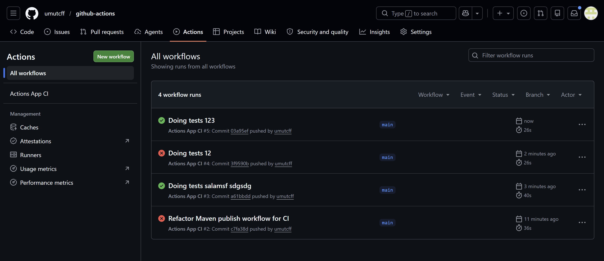

# Lab 6.07: CI with GitHub Actions

> **Duration**: 2h | **Type**: Lab

## Lab Overview

In this lab you will create a Continuous Integration pipeline for the **actions** project — a Spring Boot REST API backed by an H2 in-memory database using GitHub Actions. You will write a workflow file that automatically builds and tests the application every time code is pushed to `main` or a pull request is opened. You will watch the pipeline succeed, intentionally break it, fix it, and add a manual trigger. By the end, your repository will have a working CI pipeline that catches broken code before it reaches the main branch.

## Learning Objectives

- Create the `.github/workflows/` directory structure in a project
- Write a GitHub Actions workflow file with proper YAML syntax
- Configure triggers for push events, pull requests, and manual dispatch
- Set up JDK 17 and Maven dependency caching in a pipeline
- Use an H2 in-memory database in CI without any external services
- Read pipeline logs to diagnose build failures
- Add a workflow status badge to a .md file

## Prerequisites

- This project pushed to a GitHub repository
- Tests passing locally (`mvnw test` or running them on IntelliJ)
- A GitHub account with access to the Actions tab

---


```
actions/
├── .github/
│   └── workflows/           <-- workflow files go here
├── src/
│   ├── main/
│   │   ├── java/com/example/actions/
│   │   │   ├── controller/TvShowController.java
│   │   │   ├── model/TvShow.java
│   │   │   ├── repository/TvShowRepository.java
│   │   │   └── service/TvShowService.java
│   │   └── resources/
│   │       ├── application.properties   (H2 config + seed toggle)
│   │       └── data.sql                 (15 seeded TV shows)
│   └── test/
│       └── java/com/example/actions/
│           ├── controller/TvShowControllerTest.java
│           └── service/TvShowServiceTest.java
└── pom.xml
```

The app exposes a single endpoint:

| Method | Path       | Description          |
|--------|------------|----------------------|
| GET    | `/tvshows` | Returns all TV shows |

---

## Instructions

### Task 1: Create the Workflow Directory

GitHub Actions only looks for workflow files in one specific location.

1. **Create Directory Structure**

   In your project root, create the `.github/workflows/` directory.

   **Hint**: The `-p` flag creates parent directories as needed (macOS/Linux). On Windows use `mkdir .github\workflows`.

2. **Verify Structure**

   ```
   actions/
   ├── .github/
   │   └── workflows/       <-- workflow files go here
   ├── src/
   └── pom.xml
   ```

---

### Task 2: Write the CI Workflow

Create a file at `.github/workflows/ci.yml`.

**Required File Structure**:

```yaml
name: [Your workflow name]

on:
  # Triggers here

jobs:
  build-and-test:
    runs-on: ubuntu-latest

    steps:
      # Steps here
```

**Workflow Requirements**:

**Metadata:**
- **Name**: Give your workflow a descriptive name (e.g., "Actions App CI")

**Triggers (under `on:`):**
- Run on pushes to the `main` branch
- Run on pull requests targeting the `main` branch

**Job Configuration:**
- Single job named `build-and-test`
- Runs on `ubuntu-latest`

**Steps (in this exact order):**

1. **Checkout the code**
   - Use: `actions/checkout@v4`

2. **Set up JDK 17**
   - Use: `actions/setup-java@v4`
   - Required parameters:
     - `distribution`: `'temurin'`
     - `java-version`: `'17'`

3. **Cache Maven dependencies**
   - Use: `actions/cache@v4`
   - Required parameters:
     - `path`: `~/.m2/repository`
     - `key`: `${{ runner.os }}-maven-${{ hashFiles('**/pom.xml') }}`
     - `restore-keys`: `${{ runner.os }}-maven-`

4. **Build and test**
   - Run: `mvn clean verify`
   - No database service container is needed. The app uses H2 in-memory, which is on the classpath

**Important Considerations:**

- YAML is whitespace-sensitive; use exactly 2 spaces for indentation
- Each step must have a `name` and either `uses` or `run`
- Because the project uses H2 (not MySQL), CI requires zero external services

---

### Task 3: Push and Watch

1. Stage, commit, and push your workflow file to `main`
2. Go to the **Actions** tab on GitHub
3. Click into the run → click the `build-and-test` job → expand each step

**What to look for:**
- **Cache Maven dependencies**: says "Cache not found" on first run (expected)
- **Build and test**: all tests green, `BUILD SUCCESS`

---

### Task 4: Break It on Purpose

Proving that CI catches failures is as important as seeing it pass.

1. **Introduce a Test Failure**

   Open `TvShowControllerTest.java` and change an assertion to use a wrong value:
   ```java
   .andExpect(jsonPath("$[0].title").value("Wrong Title"))
   ```

2. **Commit and push:** watch the Actions tab show a red ✗

3. **Inspect the Failure:** expand the **Build and test** step and read the assertion mismatch in the Maven output

---

### Task 5: Fix It

1. Revert the broken assertion
2. Commit and push the fix
3. Watch the pipeline go green again
4. **Take a screenshot** of the Actions tab showing at least one red ✗ and one green ✓ run

---

### Task 6: Add Manual Trigger

Add `workflow_dispatch` to the `on:` section so the pipeline can be triggered from the GitHub UI without a push:

```yaml
on:
  push:
    branches: [main]
  pull_request:
    branches: [main]
  workflow_dispatch:
```

After pushing, go to **Actions → your workflow → Run workflow**.

---

### Task 7: Verify Caching

On any run after the first:

- Expand the **Cache Maven dependencies** step
- Confirm it says "Cache restored from key: ..." rather than "Cache not found"
- Compare build durations: first run (~60–90 s) vs. cached runs (~30–45 s)

Cache invalidates automatically when `pom.xml` changes (the key includes `hashFiles('**/pom.xml')`).

---

### Task 8: Review Your Workflow

**Checklist:**

- [ ] File exists at `.github/workflows/ci.yml`
- [ ] Workflow has a descriptive name
- [ ] Checkout uses `actions/checkout@v4`
- [ ] JDK setup uses `actions/setup-java@v4` with `distribution: 'temurin'` and `java-version: '17'`
- [ ] Cache step uses `actions/cache@v4` with correct `path`, `key`, and `restore-keys`
- [ ] Build step runs `mvn clean verify`
- [ ] All three triggers present: `push`, `pull_request`, `workflow_dispatch`
- [ ] YAML indentation is consistent (2 spaces per level)
- [ ] Pipeline runs successfully end-to-end

---

## Deliverable

Push the following to your GitHub repository:

- `.github/workflows/ci.yml`
- Screenshots from the GitHub Actions tab showing a passing build (green ✓) and a failing build (red ✗) at the end of this readme file.

Submit the repository URL.

---

## Bonus (Optional)

Add a build status badge to the top of this README.

1. Go to **Actions** → select your workflow → click **"..."** → **"Create status badge"**
2. Copy the Markdown snippet and paste it at the top of `README.md`
3. Commit and push

**Example:**
```markdown

```

The badge updates in real-time with each pipeline run.

# Super extra bonus (if you get bored 😅)

Check the [README-BONUS.md](README-BONUS.md) and complete as many exercises as you can.